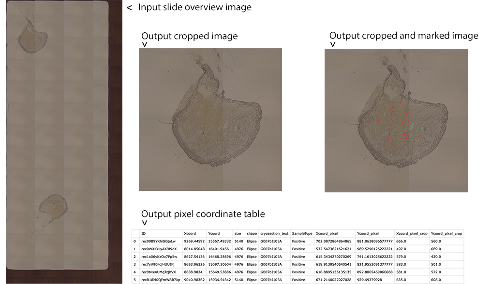

# lmdmap

**lmdmap** is a small python module to crop slide overview images into cryosection-specific overviews and to calculate and print the pixel coordinates of the microsamples. It is a tool used to display the spatial location of laser-microdissected samples in cryosection overviews, designed to generate the data displayed in the 3D'omics visualisation platform.



## Installation

The latest version of **lmdmap** and its dependencies can be easily installed in any unix environment using the following code.

```{sh}
pip install git+https://github.com/3d-omics/lmdmap.git
```

To install a specific version use the following

```{sh}
pip install git+https://github.com/3d-omics/lmdmap.git@v1.0.0
```

## Update

If a new **lmdmap** version is released, you can upgrade the module using the following code.

```{sh}
pip uninstall lmdmap
pip install git+https://github.com/3d-omics/lmdmap.git
```

## Add Airtable API KEY

**lmdmap** retrieves the information of the microsamples directly from the 3D'omics Airtable database. In order for Airtable to enable your computer to fetch data from the database you need to declare an AIRTABLE_API_KEY, which can be created for you by the database administrator.

Then, you can declare the variable for a one-time usage:
```{sh}
export AIRTABLE_API_KEY="THISISWHERETHEAPIKEYSHOULDBEPASTED"
lmdmap -n G007bI105A -i 241113G007bI105post.jpg
```

Or you can save it in your shell configuration file `~/.bashrc, ~/.zshrc` to keep it forever:
```{sh}
nano ~/.bashrc
export AIRTABLE_API_KEY="THISISWHERETHEAPIKEYSHOULDBEPASTED"
source ~/.bashrc
```

## Usage

The minimum arguments needed to use **lmdmap** are the cryosection name (***-n***), which is used to fetch the relevant information from the 3D'omics Airtable database as well as to name the default output files, and the slide overview image (***-i***) from which the cropped image is generated.

By default, **lmdmap** creates to documents in the working directory: a csv file containing the pixel coordinates, and jpg file of the cropped image.

The following optional arguments can be also used:

- ***-t*** enables defining the path and name of the csv table.
- ***-o*** enables defining the path and name of the regular cropped image.
- ***-m*** enables defining the path and name of the cropped image with the positions of microsamples marked.

Some usage examples:

```{sh}
lmdmap -n G007bI105A -i 241113G007bI105post.jpg
lmdmap -n G007bI105A -i 241113G007bI105post.jpg -t mycustomoutput.csv -o mycustomoutput.jpg -m mycustomoutput_marked.jpg
lmdmap --name G007bI105A --image input/241113G007bI105post.jpg --draw-microsamples
```
